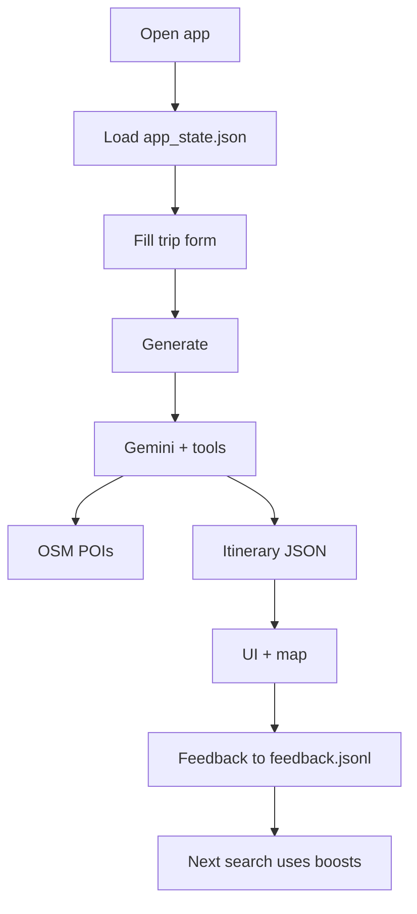
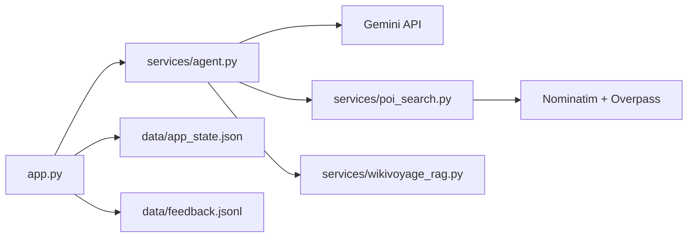

# Trip Planner AI Agent (Capstone)

Streamlit app that plans multi-day trips with **Google Gemini** (tool calling), **OpenStreetMap** POIs, optional **Wikivoyage RAG**, maps, feedback-based ranking, and persistence.

## Project structure (capstone format)

```
trip-planner/
├── app.py
├── data/
│   ├── app_state.json
│   └── feedback.jsonl
└── README.md
```

All runtime state lives under `data/` only:

| File | Purpose |
|------|---------|
| `app_state.json` | Current itinerary, form fields, agent trace, **trip history** (`trip_history` array) |
| `feedback.jsonl` | One JSON line per 👍/👎 on a POI |

> **Note:** This repo also includes `config.py`, `services/`, `requirements.txt`, and `.env` so `app.py` can stay modular. For grading/submission, the **required layout** is the tree above; run with `streamlit run app.py` from the project root.

## Setup

1. Python 3.8+ and a virtual environment:

   ```bash
   python -m venv trip-planner-env
   source trip-planner-env/bin/activate
   pip install -r requirements.txt
   ```

2. Copy `.env.example` to `.env` and set `GEMINI_API_KEY` and `OSM_CONTACT_EMAIL`.

3. Run:

   ```bash
   streamlit run app.py
   ```

## End-to-end user workflow

### 1. App start

- Streamlit loads `app.py` → `main()`.
- `_init_session()` reads `data/app_state.json` into `st.session_state` (itinerary, forms, tool state).
- Sidebar **Trip history** reads the `trip_history` list from the same `app_state.json`.
- `.env` supplies Gemini key and OSM contact email (User-Agent).

### 2. User enters a trip

- Destination, days (1–14), schedule, interests, constraints.
- Values stay in session and are saved to `app_state.json` on each run.

### 3. Generate Itinerary

- Validates inputs and API config.
- **`run_agent`** (Gemini + tools):
  - **`search_pois`** → Nominatim geocode + Overpass POIs (ranked with past **feedback** boosts).
  - **`retrieve_guides`** (optional) → Wikivoyage RAG chunks.
- Model returns JSON: `days` → `morning` / `afternoon` / `evening` → activities with `poi_id`.
- **Validation:** every `poi_id` must exist in tool results; retries on API/JSON errors.
- On success: session updated, new entry appended to `trip_history` in `app_state.json`.

### 4. View results

- Itinerary text, download JSON, refine / single-day regen, PyDeck map.
- **Travel & stays** tab: destination blurb, best/avoid seasons, **Open-Meteo** forecast (no extra API key), airports, and budget hotels.
- Agent trace in an expander (debug).

### 5. Feedback (👍 / 👎)

- Each vote appends one line to `data/feedback.jsonl`:

  `{"ts", "city_key", "poi_id", "vote": "up"|"down"}`

- Does **not** change the current itinerary.
- On the **next** `search_pois` for that city: +0.25 per up, −0.35 per down applied to ranking.

### 6. Trip history (sidebar)

- Click a saved trip to reload itinerary + form fields into the main page.
- **Clear trip history** empties the `trip_history` array in `app_state.json`.



## Architecture (how code connects)



## APIs

| Service | Key | Notes |
|--------|-----|--------|
| Google Gemini | Required (`GEMINI_API_KEY`) | Default model: `gemini-3.5-flash-lite` in `config.py` |
| Nominatim / Overpass | No | OSM contact email in `.env` |
| Wikivoyage | No | Optional; `ENABLE_WIKIVOYAGE_RAG` in `.env` |
| Open-Meteo | No | Current weather + daily forecast on the Travel tab |

## Credits

OpenStreetMap contributors, Wikivoyage, Google Gemini API.
