# Trip Planner — Complete Project Guide (info.md)

> **What this file is for:** Read this to learn what the app does, how the code flows, where data is saved, and how AI and OpenStreetMap fit in.  
> **How to run the app:** From the project folder, run `streamlit run app.py`  
> **Developer docs in the browser:** Open [http://localhost:8501/dev](http://localhost:8501/dev) (sidebar link: **Developer docs**)

---

## Table of contents

1. [30-second summary](#1-30-second-summary)
2. [Simple story — from the user’s view](#2-simple-story--from-the-users-view)
3. [Big picture flowchart](#3-big-picture-flowchart)
4. [Code map — which file does what](#4-code-map--which-file-does-what)
5. [Streamlit app flow (`app.py`)](#5-streamlit-app-flow-apppy)
6. [Agent flow — how the itinerary is built](#6-agent-flow--how-the-itinerary-is-built)
7. [POI search flow (OpenStreetMap)](#7-poi-search-flow-openstreetmap)
8. [Validation flow](#8-validation-flow)
9. [Single-day update and nearby swap](#9-single-day-update-and-nearby-swap)
10. [Feedback loop](#10-feedback-loop)
11. [Travel tab extras (weather, guide, hotels)](#11-travel-tab-extras-weather-guide-hotels)
12. [Optional Wikivoyage RAG](#12-optional-wikivoyage-rag)
13. [Data files and memory](#13-data-files-and-memory)
14. [Itinerary JSON shape](#14-itinerary-json-shape)
15. [Config and APIs](#15-config-and-apis)
16. [Errors and retries](#16-errors-and-retries)
17. [Glossary](#17-glossary)

---

## 1. 30-second summary

| Question | Answer |
|----------|--------|
| **What is this app?** | A multi-day trip planner. It uses real places from OpenStreetMap and Google Gemini to build a day-by-day schedule. |
| **UI** | Streamlit — a trip form, three tabs (Itinerary / Map / Travel & stays), and trip history in the sidebar. |
| **AI** | Google Gemini builds JSON itineraries. It may only use `poi_id` values that came from OSM search first. |
| **Places** | Nominatim (city location) and Overpass (museums, food, parks, and more). |
| **Where is data saved?** | `data/app_state.json` (trip and form fields), `data/feedback.jsonl` (thumbs up / thumbs down on stops). |

**Golden rule:** The model **must not invent places**. Every stop’s `poi_id` must exist in the `tool_state.pois` dictionary.

---

## 2. Simple story — from the user’s view

1. Open the app in the browser. Your last trip loads from disk if you had one.
2. Fill in **From**, **To**, **Days**, **Schedule**, **Interests**, and optional **Notes**. Click **Create my itinerary**.
3. Behind the scenes: the city is geocoded, OSM returns a list of places, and Gemini arranges those places into morning, afternoon, and evening blocks.
4. You see the days, a route on the map, and on the Travel tab: weather, airports, and hotels.
5. If you do not like something, you can **update one day** or **swap a nearby place** (no AI for swap).
6. Use thumbs up or thumbs down on stops. Next time you search that city, ranking changes.
7. Use the sidebar to load older trips again.

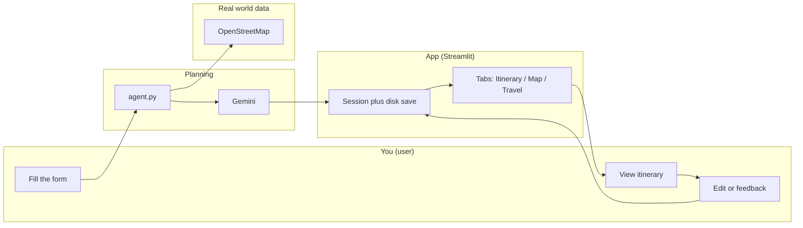

---

## 3. Big picture flowchart

The whole system in one diagram:


**Layers in plain words:**

- **UI** — Shows the page, buttons, and saves session state.
- **Agent** — Gemini plus tools. This is where itinerary JSON is created or updated.
- **Post** — After the plan exists: weather, photos, map. This runs when the page renders, not inside the agent loop.

---

## 4. Code map — which file does what

```
Travel_Planner/
├── app.py              ← Streamlit: form, buttons, tabs, persist
├── config.py           ← .env, paths, model name, boost scores
├── info.md             ← This document
├── data/
│   ├── app_state.json  ← Last trip, forms, history
│   └── feedback.jsonl  ← One line per thumbs up or down
└── services/           ← Main logic (see table below)
```

### `app.py` — main functions (good reading order)

| Function | Job |
|----------|-----|
| `main()` | Page setup, form, tabs, flush disk save at end if dirty |
| `_init_session()` | First visit: load `app_state.json` into `st.session_state` |
| `_mark_dirty()` / `_flush_persist()` / `_persist_if_dirty()` | Write session to disk only when something changed |
| `_run_generation(mode)` | Validate inputs, call `run_agent`, update session and history |
| `_render_itinerary()` | Days, feedback buttons, nearby swap |
| `_render_route_map()` | PyDeck map |
| `_render_beginner_travel_guide()` | Travel & stays tab content |

### `services/` — at a glance

| File | Short role |
|------|------------|
| `agent.py` | Gemini, fast path, tool loop, trace |
| `poi_search.py` | `search_pois` — Overpass, ranking, feedback |
| `geocoding.py` | City name to lat/lon (Nominatim) |
| `validation.py` | Form checks, JSON checks, poi_id checks |
| `refine_itinerary.py` | Small edits without LLM, add a place |
| `feedback.py` | JSONL votes to boost map |
| `persistence.py` | Read and write `app_state.json` |
| `trip_history.py` | Sidebar saved trips |
| `travel_hints.py` | Airports, budget hotels, tips |
| `destination_guide.py` | City blurb, seasons |
| `weather.py` | Open-Meteo |
| `map_viz.py` | PyDeck route |
| `nearby_pois.py` | Suggest places close to a stop |
| `place_images.py` | Images for stops and hints |
| `wikivoyage_rag.py` | Optional guide chunks |
| `http_client.py` | HTTP plus User-Agent |
| `retry_utils.py` | Gemini retries |
| `ui_components.py` / `ui_animations.py` / `trace_view.py` | UI helpers |

---

## 5. Streamlit app flow (`app.py`)

Every time you refresh or click a button, Streamlit **runs the whole script again**. That is why state lives in `st.session_state` and on disk.

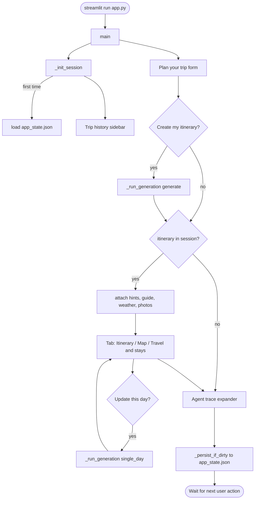

**Important design choice:** The itinerary and map render **outside** the Create button handler. If they were inside, changing a map filter could wipe the whole plan (capstone requirement).

### Session vs disk

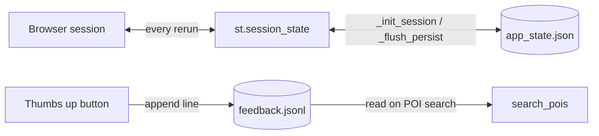

---

## 6. Agent flow — how the itinerary is built

Entry point: `services/agent.py` → `run_agent(...)`.

### 6.1 Decision tree — which path runs?

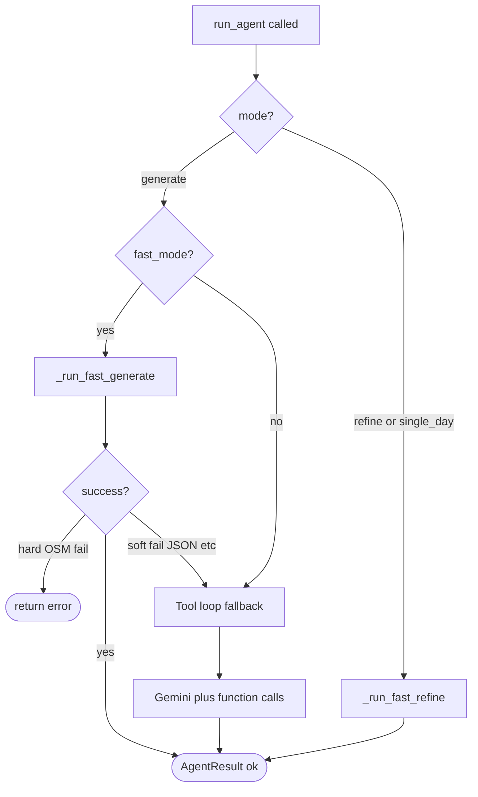

| Mode | How the UI triggers it |
|------|-------------------------|
| `generate` | **Create my itinerary** |
| `single_day` | **Update this day** plus your change text |
| `refine` | Supported in code; full-trip refine UI is optional |

Default: **`fast_mode=True`** (from `app.py` → `_agent_settings()`).

### 6.2 Fast generate (default path) — step flowchart

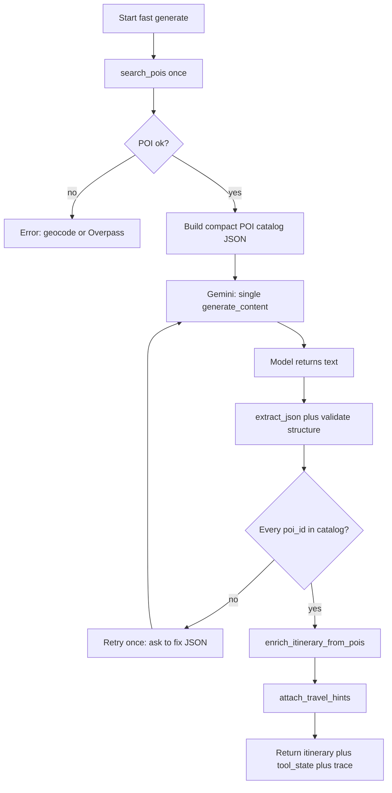

**What Gemini gets:** trip days, pace, interests, constraints, and an **allowed POI list only** (id, name, category).

**What Gemini returns:** one JSON object with `days[]` and `morning` / `afternoon` / `evening` arrays.

### 6.3 Tool loop (fallback) — flowchart

When the fast path fails (JSON or tools) or fast mode is off:

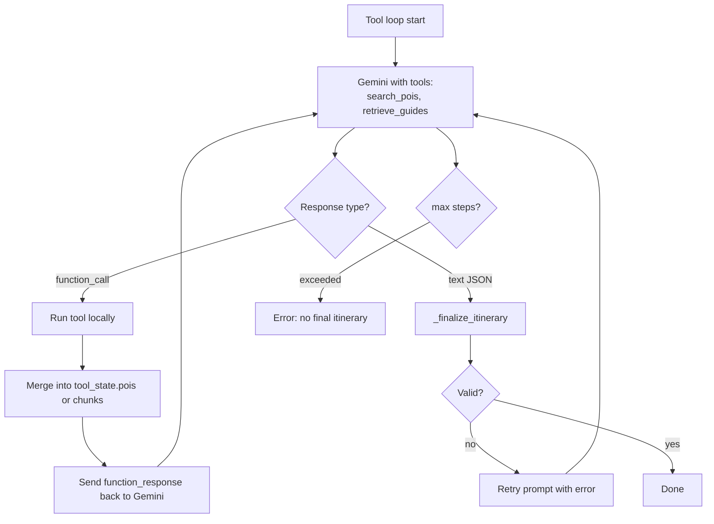

Tools are declared in `agent.py` → `_gemini_tools()`.

### 6.4 Sequence diagram — Create my itinerary

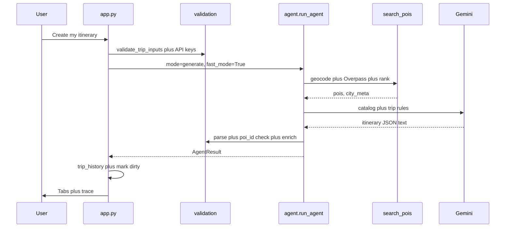

### 6.5 Fast refine / single day — flowchart

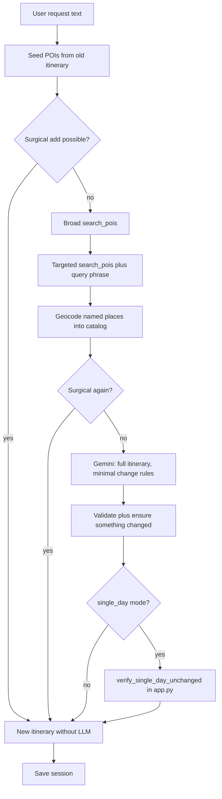

---

## 7. POI search flow (OpenStreetMap)

Function: `search_pois(city, interests, user_agent, limit, query_text?, fast?)`

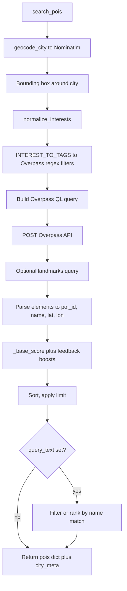

**Interest examples (what you type → what OSM searches):**

| User interest | OSM idea |
|---------------|----------|
| museums | `tourism=museum|gallery` |
| food | `amenity=restaurant|cafe|…` |
| outdoors | parks, beaches, peaks |
| history | `historic`, attractions |

If nothing matches well, the app uses a default mix: museums, food, outdoors.

**poi_id format:** `osm_node_123`, `osm_way_456`, and so on. Validation checks against this pattern.

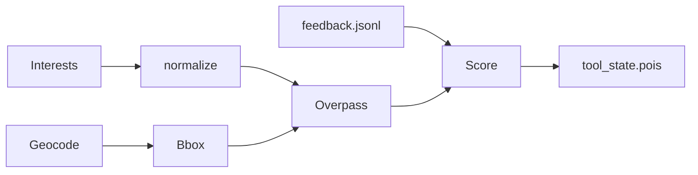

---

## 8. Validation flow

Validation happens in two places.

**A) Form (before the agent runs)** — `validate_trip_inputs`

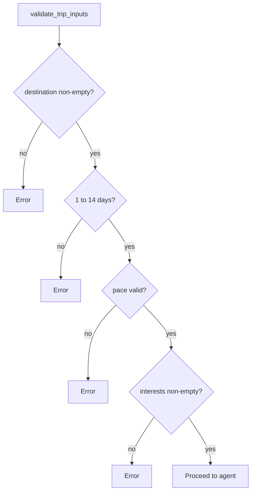

**B) Model output (after the agent)** — `_finalize_itinerary`

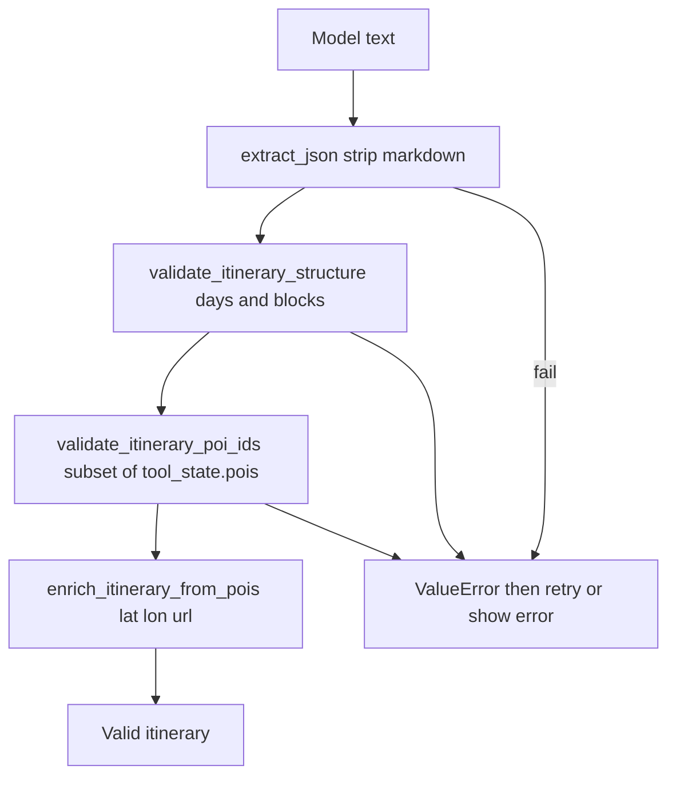

---

## 9. Single-day update and nearby swap

### Single day (uses AI)

You pick a day number and type **What should change?** → `_run_generation("single_day", ...)`.

Same refine pipeline as other updates. **Extra rule:** all other days must stay the same (`verify_single_day_unchanged`).

### Nearby swap (no AI)

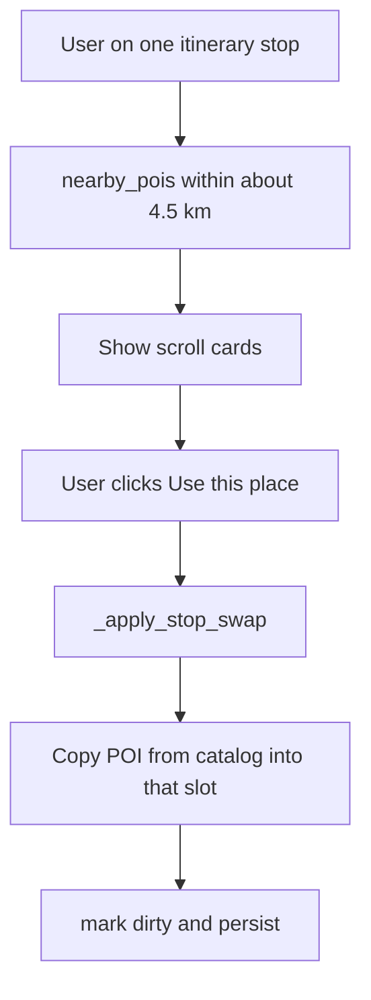

Gemini is **not** called here. One catalog entry replaces the stop.

---

## 10. Feedback loop

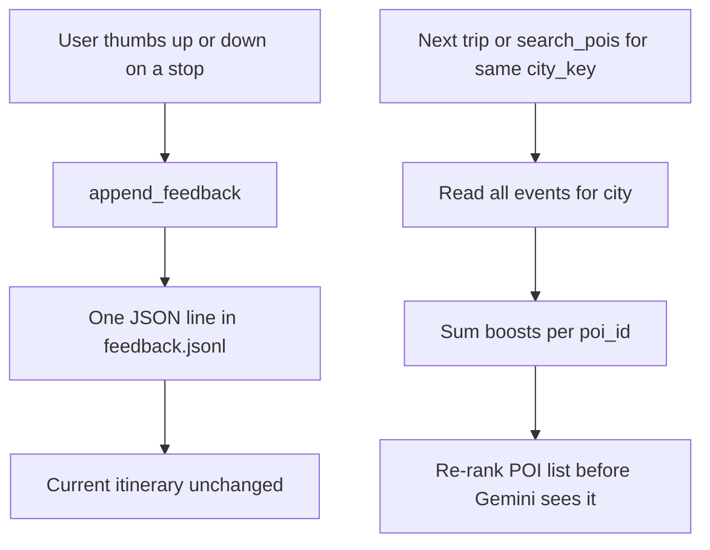

| Vote | Score change (per event) |
|------|---------------------------|
| Thumbs up | +0.25 |
| Thumbs down | −0.35 |

Scoped by **`city_key`** from geocode metadata. The same POI id in two cities is counted separately.

---

## 11. Travel tab extras (weather, guide, hotels)

After the itinerary exists, each page render adds extras (with cache keys to avoid repeat work):

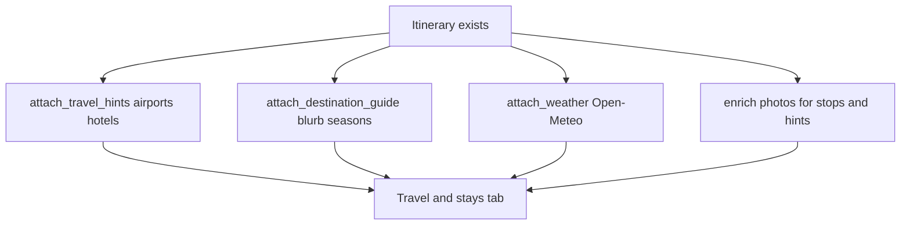

| Cache key in tool_state | When it refreshes |
|-------------------------|-------------------|
| `_hints_key` | `v5|origin|dest` changes |
| `_photos_key` | hints key changes |
| `_guide_key` | destination changes |
| `_weather_key` | `dest|trip_days` changes |

**Map tab** is separate: `map_viz.build_deck` — green start, purple destination, pink airport, orange visit path.

---

## 12. Optional Wikivoyage RAG

Off by default (`ENABLE_WIKIVOYAGE_RAG` in `.env`). Fast agent mode does not use RAG.

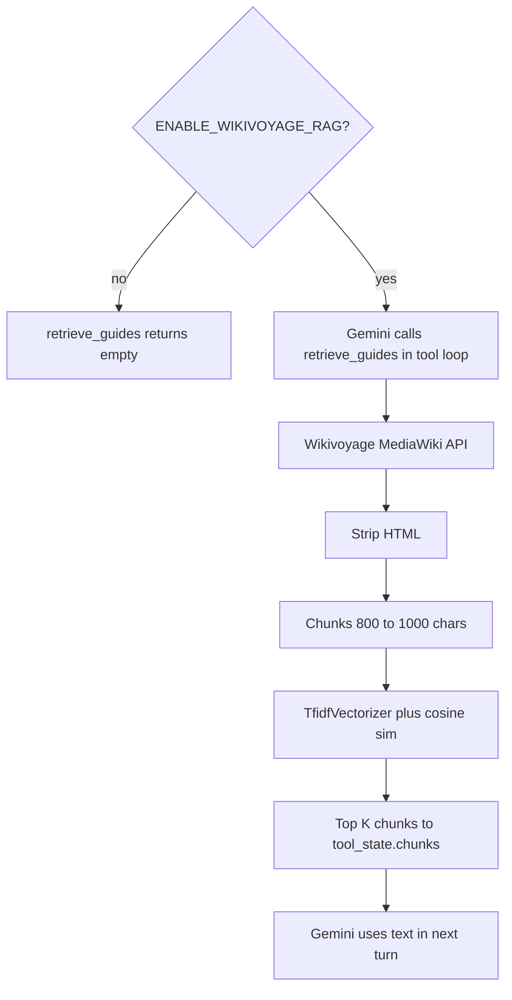

---

## 13. Data files and memory

### `app_state.json` — what is stored

| Key | Meaning |
|-----|---------|
| `itinerary` | Current plan JSON |
| `tool_state` | POI catalog, hints, weather, cache keys |
| `agent_trace` | Debug timeline of the last agent run |
| `form_destination`, `form_origin`, … | Form default values |
| `trip_history[]` | Snapshots of past trips |

### `tool_state` — for planner and UI

| Key | Meaning |
|-----|---------|
| `pois` | All known places by id |
| `city_meta` | Includes `city_key` for feedback |
| `travel_hints`, `destination_guide`, `weather` | Travel tab |
| `chunks` | Wikivoyage RAG (if any) |

### User journey on disk

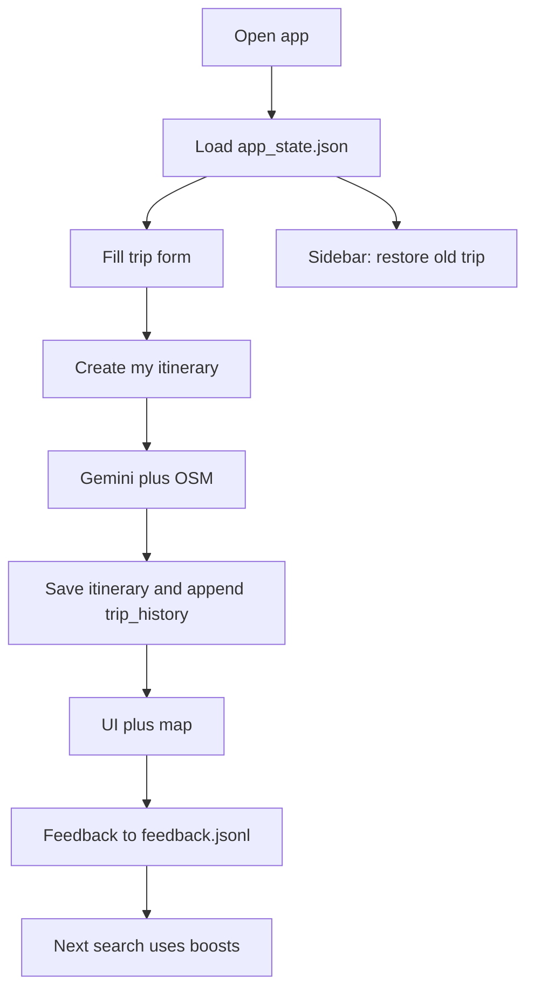

---

## 14. Itinerary JSON shape

```json
{
  "destination": "Goa",
  "days": [
    {
      "day": 1,
      "morning": [
        {
          "poi_id": "osm_node_12345",
          "name": "Place name",
          "why": "One short sentence in English"
        }
      ],
      "afternoon": [],
      "evening": []
    }
  ]
}
```

Each day has **three fixed blocks**: `morning`, `afternoon`, `evening`. Empty lists are allowed.

After enrichment you may also see: `lat`, `lon`, `category`, `url`, and sometimes `image_url`.

---

## 15. Config and APIs

### Setup

1. `python -m venv trip-planner-env` → activate → `pip install -r requirements.txt`
2. Copy `.env.example` → `.env`
3. `streamlit run app.py`

### Environment

| Variable | Required | Purpose |
|----------|----------|---------|
| `GEMINI_API_KEY` | Yes | Gemini |
| `OSM_CONTACT_EMAIL` | Yes | OSM User-Agent (policy) |
| `ENABLE_WIKIVOYAGE_RAG` | No | `true` = RAG in tool loop |

### External services

| Service | API key? | Use |
|---------|----------|-----|
| Google Gemini | Yes | Itinerary JSON |
| Nominatim / Overpass | No (email only) | Geocode and POIs |
| Wikivoyage | No | Optional RAG |
| Open-Meteo | No | Weather |

### Important `config.py` numbers

| Setting | Value |
|---------|--------|
| `DEFAULT_MODEL` | `gemini-3.5-flash-lite` (plus fallbacks) |
| `FAST_POI_LIMIT` | 45 |
| `UPVOTE_BOOST` / `DOWNVOTE_BOOST` | 0.25 / −0.35 |

---

## 16. Errors and retries


The user sees **`st.error(last_error)`**. Sometimes **Export & advanced** shows raw model output.

**Agent trace** (expander at the bottom of the page): each step — tool name, milliseconds, detail — for debugging.

---

## 17. Glossary

| Term | Meaning |
|------|---------|
| **POI** | Point of interest — museum, restaurant, park, and so on |
| **poi_id** | OSM-based stable id string in the catalog |
| **tool_state** | Shared memory for agent and UI (especially `pois`) |
| **Fast mode** | Fewer steps: direct OSM plus one Gemini call (default) |
| **Tool loop** | Gemini calls `search_pois` / `retrieve_guides` itself |
| **RAG** | Retrieval: Wikivoyage text chunks give the model extra context |
| **city_key** | Feedback scope — usually a normalized city name |
| **Surgical refine** | Small code-only edit without the LLM |
| **Session rerun** | Streamlit runs the script again on every interaction |

---

## Credits

OpenStreetMap contributors, Wikivoyage, Google Gemini API, Open-Meteo.

---

## Document updates

| When | What |
|------|------|
| Initial | Full architecture and flowcharts |
| Rewrite | English-only, simple language; persistence and UI aligned with current `app.py` |

*When you add features, update the matching section and flowchart in this file.*
