# Trip Planner — पूरा project guide (info.md)

> **Is file ka goal:** Sirf yeh padh kar tumhe samajh aa jaye — app kya karti hai, code ka flow kya hai, data kahan jaata hai, aur AI/OSM ka role kya hai.  
> **Chalane ke liye:** project root se `streamlit run app.py`

---

## Table of contents

1. [30-second summary](#1-30-second-summary)
2. [Simple story — user ki nazar se](#2-simple-story--user-ki-nazar-se)
3. [Big picture flowchart](#3-big-picture-flowchart)
4. [Code map — kaunsi file kya karti hai](#4-code-map--kaunsi-file-kya-karti-hai)
5. [Streamlit app flow (`app.py`)](#5-streamlit-app-flow-apppy)
6. [Agent flow — itinerary kaise banti hai](#6-agent-flow--itinerary-kaise-banti-hai)
7. [POI search flow (OpenStreetMap)](#7-poi-search-flow-openstreetmap)
8. [Validation flow](#8-validation-flow)
9. [Single-day update & nearby swap](#9-single-day-update--nearby-swap)
10. [Feedback loop](#10-feedback-loop)
11. [Travel tab extras (weather, guide, hotels)](#11-travel-tab-extras)
12. [Optional Wikivoyage RAG](#12-optional-wikivoyage-rag)
13. [Data files & memory](#13-data-files--memory)
14. [Itinerary JSON shape](#14-itinerary-json-shape)
15. [Config & APIs](#15-config--apis)
16. [Errors & retries](#16-errors--retries)
17. [Glossary](#17-glossary)

---

## 1. 30-second summary

| Question | Answer |
|----------|--------|
| **Yeh app kya hai?** | Multi-day trip planner: real places (OSM) + Gemini AI day-by-day schedule |
| **UI** | Streamlit — form, 3 tabs (Itinerary / Map / Travel), sidebar history |
| **AI** | Google Gemini — JSON itinerary banata hai; sirf wahi `poi_id` use kar sakta hai jo pehle OSM se aaye |
| **Places** | Nominatim (city location) + Overpass (museums, food, parks, …) |
| **Save kahan?** | `data/app_state.json` (trip + forms), `data/feedback.jsonl` (👍/👎) |

**Golden rule:** Model **khud se jagah invent nahi kar sakta**. Har stop ka `poi_id` `tool_state.pois` dictionary mein hona chahiye.

---

## 2. Simple story — user ki nazar se

1. Browser mein app kholo → purana trip (agar tha) disk se load ho jata hai.
2. **From / To / Days / Interests** bharo → **Create my itinerary**.
3. Peeche: city geocode → OSM se places list → Gemini un places ko morning/afternoon/evening mein arrange karta hai.
4. Tumhe days dikhte hain, map par route, Travel tab par weather + airports + hotels.
5. Pasand na aaye to **ek din update** kar sakte ho, ya **nearby place swap** (bina AI).
6. 👍/👎 likho — agli baar us city mein search par ranking badal jati hai.
7. Sidebar se purane trips dubara load kar sakte ho.

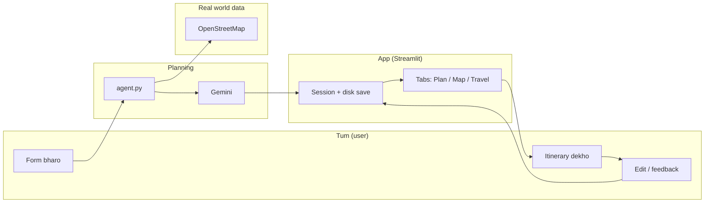

---

## 3. Big picture flowchart

Poora system ek diagram mein:

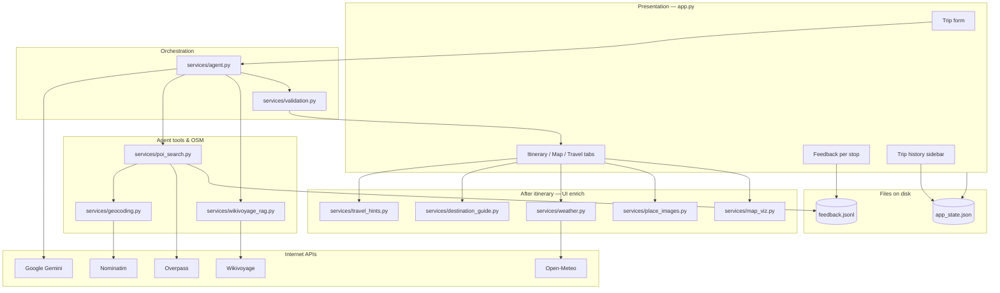

**Layers samjho:**

- **UI** — sirf dikhana, buttons, save session.
- **Agent** — Gemini + tools; yahi itinerary JSON banata/ update karta hai.
- **Post** — itinerary ke baad weather, photos, map (agent ke andar nahi, page render par).

---

## 4. Code map — kaunsi file kya karti hai

```
Travel_Planner/
├── app.py              ← Streamlit: form, buttons, tabs, persist
├── config.py           ← .env, paths, model name, boost scores
├── info.md             ← Yeh document
├── data/
│   ├── app_state.json  ← Last trip + forms + history
│   └── feedback.jsonl  ← Har 👍/👎 ek line
└── services/           ← Asli logic (neeche table)
```

### `app.py` — main functions (padhne ka order)

| Function | Kaam |
|----------|------|
| `main()` | Page setup, form, tabs, har run par `_persist()` |
| `_init_session()` | Pehli baar `app_state.json` → `st.session_state` |
| `_persist()` | Session → disk (history preserve) |
| `_run_generation(mode)` | Validate → `run_agent` → session update → history |
| `_render_itinerary()` | Days, feedback, nearby swap |
| `_render_route_map()` | PyDeck map |
| `_render_beginner_travel_guide()` | Travel tab content |

### `services/` — ek nazar mein

| File | Short role |
|------|------------|
| `agent.py` | Gemini + fast/tool paths, trace |
| `poi_search.py` | `search_pois` — Overpass + ranking + feedback |
| `geocoding.py` | City → lat/lon (Nominatim) |
| `validation.py` | Form + JSON + poi_id checks |
| `refine_itinerary.py` | Bina LLM chhote edits, add place |
| `feedback.py` | JSONL votes → boost map |
| `persistence.py` | Read/write `app_state.json` |
| `trip_history.py` | Sidebar saved trips |
| `travel_hints.py` | Airports, budget hotels, tips |
| `destination_guide.py` | City blurb, seasons |
| `weather.py` | Open-Meteo |
| `map_viz.py` | PyDeck route |
| `nearby_pois.py` | Paas ki jagah suggest |
| `place_images.py` | Stop/hint images |
| `wikivoyage_rag.py` | Optional guide chunks |
| `http_client.py` | HTTP + User-Agent |
| `retry_utils.py` | Gemini retries |
| `ui_components.py` / `ui_animations.py` / `trace_view.py` | UI helpers |

---

## 5. Streamlit app flow (`app.py`)

Har baar tum page refresh / button dabate ho, Streamlit **poora script dubara** chalata hai. Isliye state `st.session_state` + disk par rakhi hai.

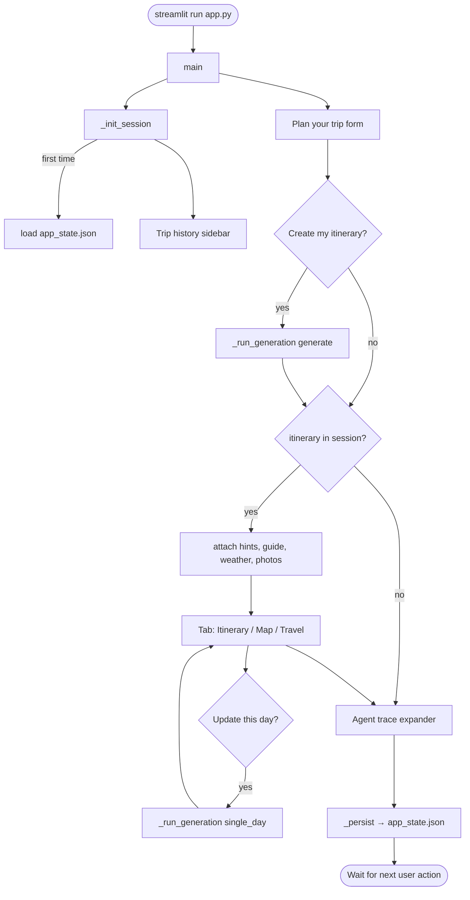

**Important design choice:** Itinerary + map **button ke bahar** render hote hain — warna map filter change par poora plan gayab ho sakta tha (capstone requirement).

### Session vs disk

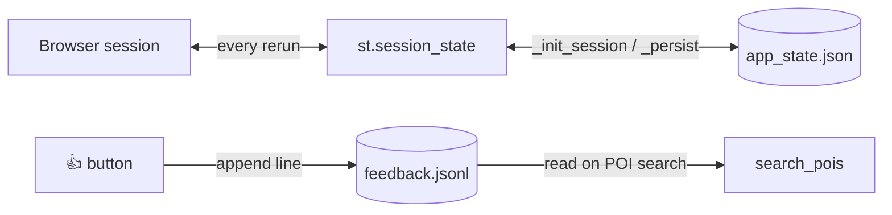

---

## 6. Agent flow — itinerary kaise banti hai

Entry: `services/agent.py` → `run_agent(...)`.

### 6.1 Decision tree — kaunsa path chalega?

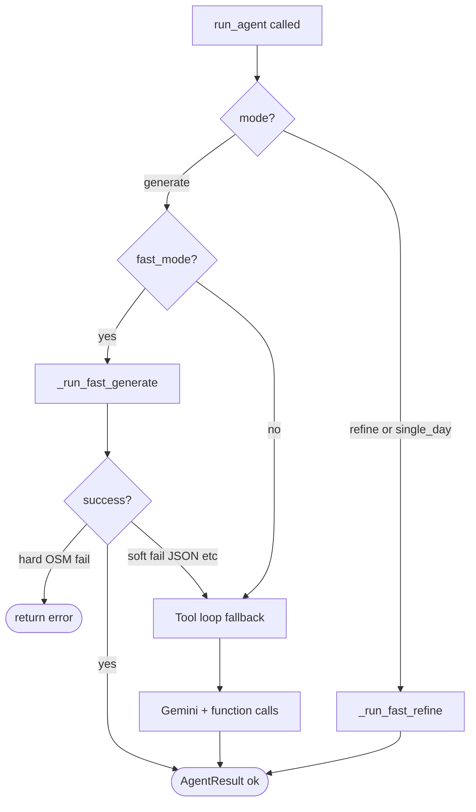

| Mode | UI se kaise trigger |
|------|---------------------|
| `generate` | **Create my itinerary** |
| `single_day` | **Update this day** + text |
| `refine` | Code support hai; full-trip refine UI optional |

Default: **`fast_mode=True`** (`app.py` → `_agent_settings()`).

### 6.2 Fast generate (default path) — step flowchart

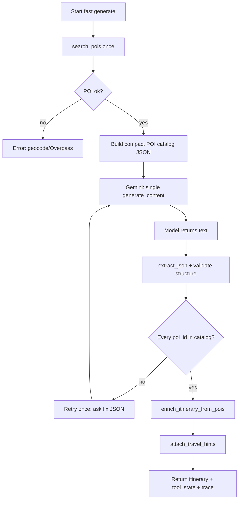

**Gemini ko kya milta hai:** trip days, pace, interests, constraints, aur **sirf allowed POI list** (id + name + category).

**Gemini kya deta hai:** ek JSON object — `days[]` with `morning` / `afternoon` / `evening` arrays.

### 6.3 Tool loop (fallback) — flowchart

Jab fast path fail ho (JSON/tools) ya fast mode off ho:


Tools declare: `agent.py` → `_gemini_tools()`.

### 6.4 Sequence diagram — generate button

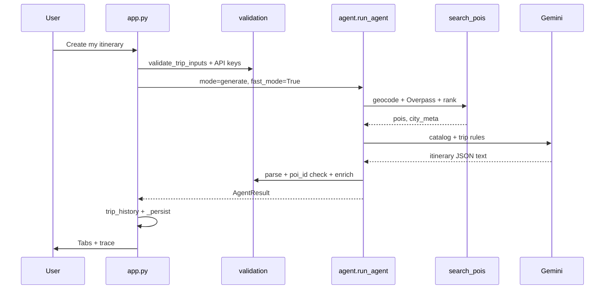

### 6.5 Fast refine / single day — flowchart


---

## 7. POI search flow (OpenStreetMap)

`search_pois(city, interests, user_agent, limit, query_text?, fast?)`

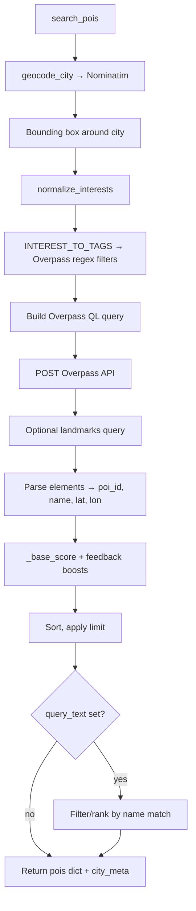

**Interest examples (UI text → OSM):**

| User interest | OSM idea |
|---------------|----------|
| museums | `tourism=museum|gallery` |
| food | `amenity=restaurant|cafe|…` |
| outdoors | parks, beaches, peaks |
| history | `historic`, attractions |

Agar kuch match na ho → default mix: museums, food, outdoors.

**poi_id format:** `osm_node_123`, `osm_way_456`, … (validation isi se match karti hai).

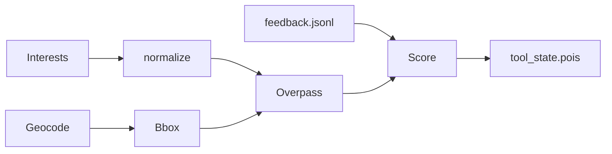

---

## 8. Validation flow

Do jagah validation:

**A) Form (button se pehle)** — `validate_trip_inputs`

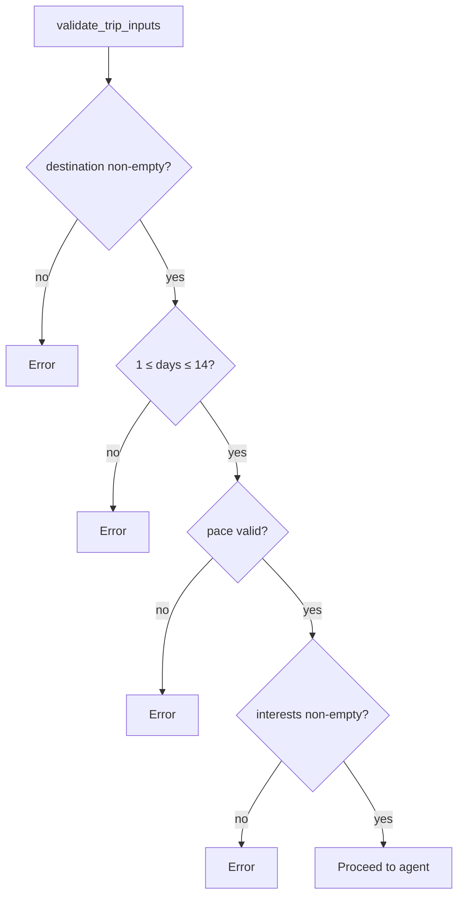

**B) Model output (agent ke baad)** — `_finalize_itinerary`

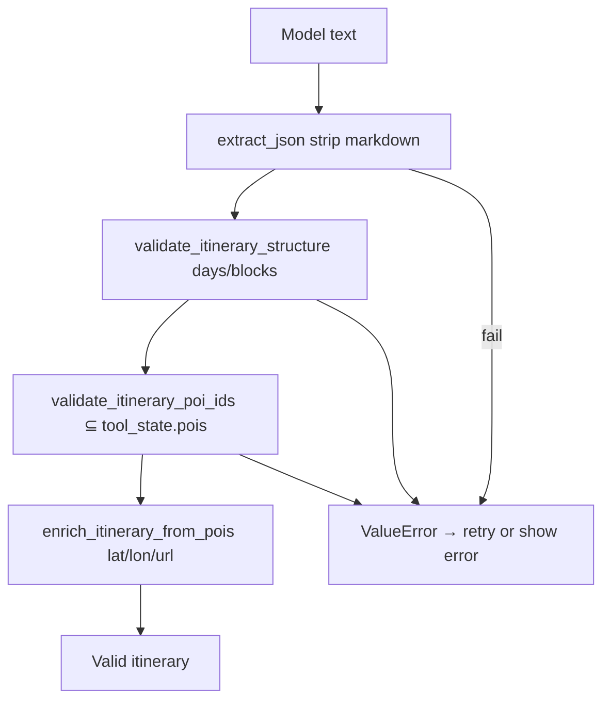

---

## 9. Single-day update & nearby swap

### Single day (AI)

User: day number + “What should change?” → `_run_generation("single_day", ...)`.

Same refine pipeline; **extra guard:** baaki din byte-for-byte same hone chahiye (`verify_single_day_unchanged`).

### Nearby swap (no AI)

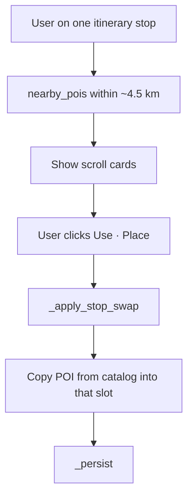

Yahan Gemini call **nahi** hoti — sirf catalog se ek entry replace hoti hai.

---

## 10. Feedback loop

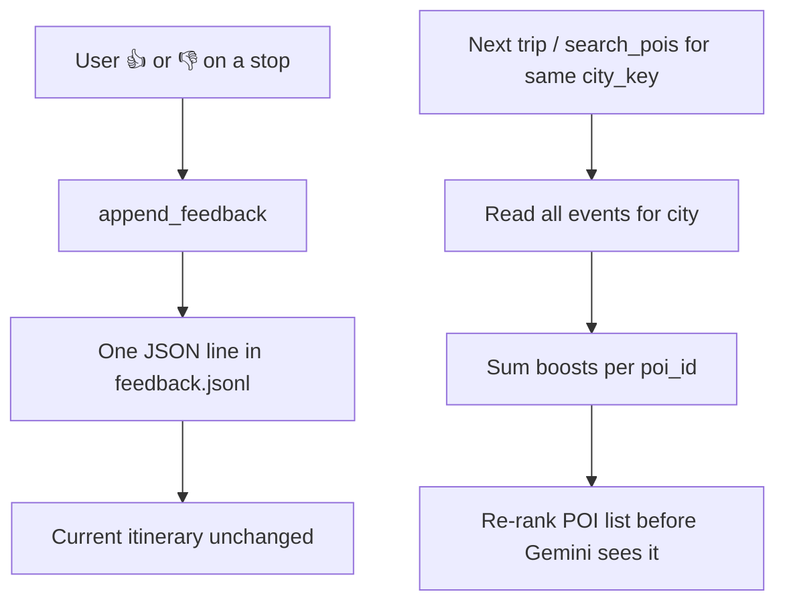

| Vote | Score change (per event) |
|------|---------------------------|
| 👍 up | +0.25 |
| 👎 down | −0.35 |

Scoped by **`city_key`** from geocode metadata — same POI id do cities mein alag count hota hai.

---

## 11. Travel tab extras

Itinerary banne ke **baad**, har page render par (cache keys se optimize):

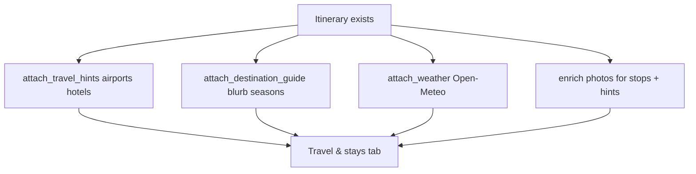

| Cache key in tool_state | Kab refresh |
|-------------------------|-------------|
| `_hints_key` | `origin|dest` change |
| `_photos_key` | hints key change |
| `_guide_key` | destination change |
| `_weather_key` | `dest|trip_days` change |

**Map tab** alag: `map_viz.build_deck` — green start, purple dest, pink airport, orange visit path.

---

## 12. Optional Wikivoyage RAG

Off by default (`ENABLE_WIKIVOYAGE_RAG` in `.env`). Fast agent mode mein RAG band.

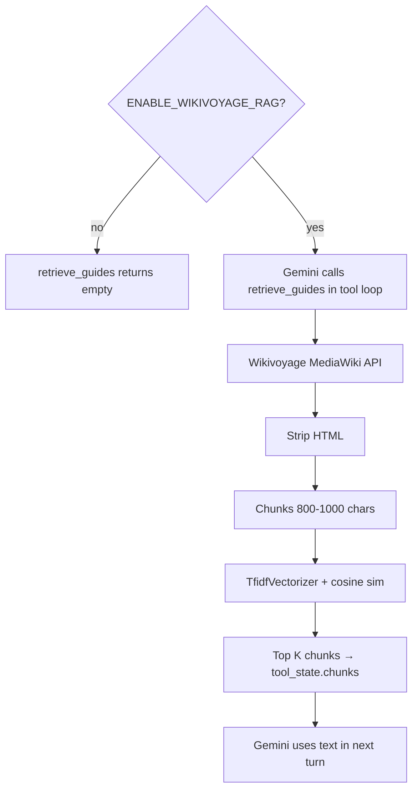

---

## 13. Data files & memory

### `app_state.json` — kya store hota hai

| Key | Meaning |
|-----|---------|
| `itinerary` | Current plan JSON |
| `tool_state` | POI catalog + hints + weather + cache keys |
| `agent_trace` | Debug timeline of last agent run |
| `form_destination`, `form_origin`, … | Form defaults |
| `trip_history[]` | Past trips snapshots |

### `tool_state` — planner + UI ke liye

| Key | Meaning |
|-----|---------|
| `pois` | All known places by id |
| `city_meta` | Includes `city_key` for feedback |
| `travel_hints`, `destination_guide`, `weather` | Travel tab |
| `chunks` | Wikivoyage RAG (if any) |

### User journey on disk

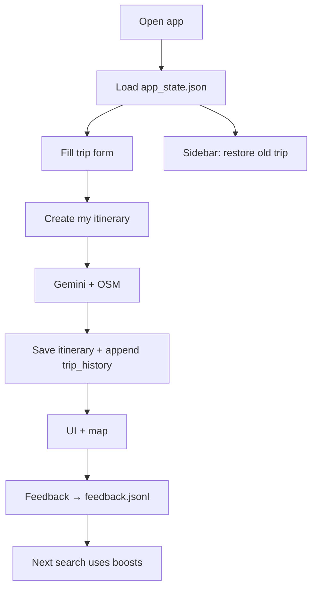

---

## 14. Itinerary JSON shape

```json
{
  "destination": "Goa",
  "days": [
    {
      "day": 1,
      "morning": [
        {
          "poi_id": "osm_node_12345",
          "name": "Place name",
          "why": "One short sentence in English"
        }
      ],
      "afternoon": [],
      "evening": []
    }
  ]
}
```

Har din mein **teen blocks** fixed hain: `morning`, `afternoon`, `evening` (khaali list allowed).

Enrichment ke baad: `lat`, `lon`, `category`, `url`, kabhi `image_url`.

---

## 15. Config & APIs

### Setup

1. `python -m venv trip-planner-env` → activate → `pip install -r requirements.txt`
2. Copy `.env.example` → `.env`
3. `streamlit run app.py`

### Environment

| Variable | Required | Purpose |
|----------|----------|---------|
| `GEMINI_API_KEY` | Yes | Gemini |
| `OSM_CONTACT_EMAIL` | Yes | OSM User-Agent (policy) |
| `ENABLE_WIKIVOYAGE_RAG` | No | `true` = RAG in tool loop |

### External services

| Service | Key? | Use |
|---------|------|-----|
| Google Gemini | Yes | Itinerary JSON |
| Nominatim / Overpass | No (email) | Geocode + POIs |
| Wikivoyage | No | Optional RAG |
| Open-Meteo | No | Weather |

### Important `config.py` numbers

| Setting | Value |
|---------|--------|
| `DEFAULT_MODEL` | `gemini-3.5-flash-lite` (+ fallbacks) |
| `FAST_POI_LIMIT` | 45 |
| `UPVOTE_BOOST` / `DOWNVOTE_BOOST` | 0.25 / −0.35 |

---

## 16. Errors & retries

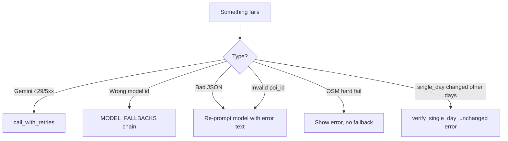

User ko **`st.error(last_error)`** dikhta hai; kabhi **Export & advanced** mein raw model output.

**Agent trace** (page ke neeche expander): har step — tool name, ms, detail — debugging ke liye.

---

## 17. Glossary

| Term | Matlab |
|------|--------|
| **POI** | Point of interest — museum, restaurant, park, … |
| **poi_id** | OSM-based stable id string in catalog |
| **tool_state** | Agent + UI shared memory (especially `pois`) |
| **Fast mode** | Kam steps: direct OSM + 1 Gemini call (default) |
| **Tool loop** | Gemini khud `search_pois` / `retrieve_guides` call karta hai |
| **RAG** | Retrieval: Wikivoyage text chunks model ko extra context |
| **city_key** | Feedback scope — usually normalized city name |
| **Surgical refine** | Chhota code-only edit, LLM ke bina |
| **Session rerun** | Streamlit har interaction par script dubara chalata hai |

---

## Credits

OpenStreetMap contributors, Wikivoyage, Google Gemini API, Open-Meteo.

---

## Document updates

| When | What |
|------|------|
| Initial | Full architecture + flowcharts + Hindi/English guide tone |

*Naye features aane par is file ke relevant section + flowchart update karna.*
